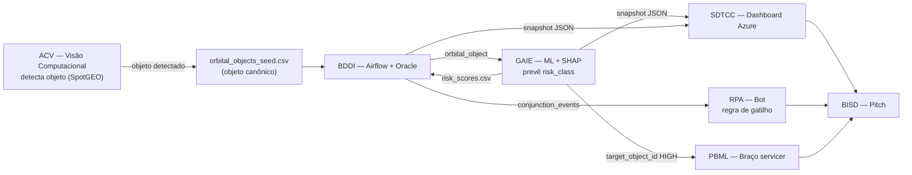

# GAIE — Previsão de Risco de Colisão Orbital (Global Solution 2026/1 · Indústria Espacial)

Pipeline completo de Machine Learning que prevê a **classe de risco de colisão** (`HIGH` / `MEDIUM` / `LOW`)
de objetos em órbita, com **interpretabilidade via SHAP** e **demo em Streamlit**. Componente da
plataforma de sustentabilidade orbital da Global Solution — sua saída (`risk_class`) alimenta o
dashboard (SDTCC), o bot de alerta (RPA) e a seleção de alvo do braço-servicer (PBML).

**Integrantes:** Pedro Farath — RM98608 · Lucca Vilaça — RM551538 · João Victor — RM550453 · Juliana Maita — RM99224 · Luana Cabezaolias — RM99320

**Aplicação no ar:** https://gs-giae-4esr.streamlit.app

> **Como usar a demo:** o **tipo do objeto é o fator dominante** — `PAYLOAD` (manobrável) tende a `LOW`
> em quase qualquer configuração; risco `MEDIUM`/`HIGH` aparece em `DEBRIS`/`ROCKET_BODY`. Use os botões
> **"Exemplo de ALTO/BAIXO risco"** para ver os extremos. A predição é ao vivo (não precisa clicar nada).

---

## 1. Definição do problema
Dado um objeto orbital (satélite, corpo de foguete ou detrito) descrito por atributos orbitais e
físicos, prever sua classe de risco de colisão. É um problema de **classificação multiclasse** (3 classes)
diretamente conectado à Indústria Espacial: priorizar quais objetos monitorar e quais acionar resposta.

## 2. Dataset
`orbital_objects_seed.csv` — **1.100 objetos × 13 colunas** (satisfaz o mínimo de ≥1000×10 do edital),
gerado proceduralmente seguindo o `data_contract.md` do projeto (elementos orbitais plausíveis em
LEO/MEO/GEO, RCS e BSTAR coerentes). O rótulo `risk_class` é derivado de uma regra ruidosa
(congestão por altitude + tamanho + tipo do objeto), garantindo sinal aprendível mas não trivial.

- Balanço: LOW 605 · MEDIUM 330 · HIGH 165 (minoritária) → **split estratificado** obrigatório.

## 3. Metodologia (pipeline ML completo)
1. **Pré-processamento + feature engineering:** `log_rcs` (comprime cauda do RCS), `altitude_band`
   (regime LEO/MEO/GEO). Encoding por família de modelo: `OrdinalEncoder` (árvores) e
   `OneHotEncoder` + `StandardScaler` (linear) — comparação justa.
2. **Split estratificado 75/25** com `random_state=42`.
3. **3 modelos comparados via `GridSearchCV` 5-fold** (mesma métrica): RandomForest, GradientBoosting
   e LogisticRegression (baseline linear).
4. **Validação:** `classification_report` por classe + matriz de confusão + **ROC-AUC multiclasse (OvR)**.
5. **SHAP:** `TreeExplainer` com `summary_plot` (global) e `waterfall` (local).
6. **Deploy:** Streamlit (`app.py`), modelo serializado com `joblib`.

## 4. Resultados

| Modelo | CV acc (5-fold) | Test acc | Macro F1 | ROC-AUC (OvR) |
|---|---|---|---|---|
| **RandomForest (deployado)** | 0.853 | **0.873** | **0.832** | **0.950** |
| GradientBoosting | 0.873 | 0.865 | 0.821 | 0.949 |
| LogisticRegression (baseline) | 0.714 | 0.695 | 0.562 | 0.847 |

**Modelo escolhido: RandomForest** — maior acurácia no teste e maior macro-F1, ROC-AUC no topo, e
SHAP exato via `TreeExplainer`. O baseline linear fica ~18 pontos abaixo → a fronteira do problema é
não-linear, justificando os modelos de árvore.

## 5. Interpretabilidade (SHAP)
Importância global medida (`mean|SHAP|`, média entre classes):

| Feature | Importância |
|---|---|
| `object_type` | 28.8% |
| **regime orbital** (`period_min` + `altitude_km`) | **41.3%** |
| tamanho (`rcs_value_m2` + `log_rcs`) | ~13% |

Coerente com o `data_contract.md` e com a física: objetos não-manobráveis (detrito/foguete), em
bandas orbitais congestionadas e de maior tamanho, concentram o risco `HIGH`. O `app.py` mostra o
**waterfall SHAP da predição individual** — auditável antes de acionar resposta (RPA/PBML).

## 6. Coesão com a Global Solution
Esquema idêntico ao `data_contract.md` (mesmos nomes de coluna, `object_id` como chave, categorias
`HIGH/MEDIUM/LOW`). O notebook exporta **`risk_scores.csv`** (`object_id`, `risk_class`) — o handoff
HARD consumido por BDDI/SDTCC. Diagrama-mestre do sistema (o mesmo dos PDFs de BDDI/SDTCC e do BPMN do RPA):



## 7. Como rodar
```bash
pip install -r requirements.txt
jupyter notebook gaie_orbital_risk.ipynb   # Run all → gera modelo + risk_scores.csv
streamlit run app.py                       # demo local
```
No Colab: suba `orbital_objects_seed.csv` para `/content/` e `Runtime → Run all`.

## 8. Deploy (Streamlit Community Cloud)
1. Repositório público no GitHub com: `app.py`, `requirements.txt`, `gaie_risk_model.joblib`,
   `gaie_meta.json`, `gaie_orbital_risk.ipynb`, `orbital_objects_seed.csv`, `README.md`.
2. `share.streamlit.io` → login GitHub → New app → aponte para o repo, branch `main`, arquivo `app.py`.
3. A URL pública resultante vai no topo deste README e na entrega.

## 9. Limitações (declaradas)
Dataset **sintético** (rótulo por regra ruidosa): o trabalho prova a **metodologia** (pipeline,
comparação de 3 modelos, validação, SHAP), não um classificador validado contra colisões reais.
Trabalho futuro: TLEs do CelesTrak + eventos de conjunção do SOCRATES.

## Arquivos
```
gaie_orbital_risk.ipynb   # notebook executado (pipeline completo + SHAP)
app.py                    # demo Streamlit (predição + waterfall SHAP)
gaie_risk_model.joblib    # RandomForest treinado (deployado)
gaie_meta.json            # features/classes/metadados para a demo
risk_scores.csv           # handoff GAIE → BDDI/SDTCC (object_id, risk_class)
orbital_objects_seed.csv  # dataset canônico (data_contract.md)
data_contract.md          # esquema-fonte da Global Solution
requirements.txt
```
