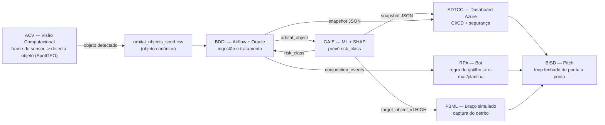

# DATA CONTRACT — Global Solution 2026/1 · Indústria Espacial

**Projeto:** Plataforma de sustentabilidade orbital (rastreio de risco de conjunção + servicer de captura)
**Versão:** 1.0 · **Congelar no Dia 1.** Mudança de esquema = mudança de versão + aviso a todos os donos de disciplina.

---

## Por que este documento existe

A rubrica desta GS pesa ~20% em **coesão entre disciplinas** ("sistema coeso, não um conjunto de partes separadas" — brief, pág. 2-3). As 7 entregas vão para portais separados e **não** se integram em runtime. O que prova que são *um sistema* é: **(1)** todas falam do mesmo objeto, com os mesmos nomes de campo, unidades e IDs; **(2)** o mesmo `object_id` aparece com o mesmo `risk_class` em GAIE, BDDI, SDTCC e RPA; **(3)** todas usam o mesmo diagrama de arquitetura.

Este arquivo é a fonte de verdade do esquema. Se uma disciplina inventar nome de coluna próprio, a coesão quebra. Ninguém improvisa nomes.

---

## Convenções globais (valem para todas as disciplinas)

| Regra | Valor |
|---|---|
| Nomes de coluna | `snake_case`, minúsculo, sem espaço/acento, ≤ 30 chars (compatível com Oracle) |
| Encoding | UTF-8, separador `,`, sem BOM |
| Timestamps | ISO 8601 UTC com sufixo `Z` — ex.: `2026-05-25T14:03:00Z` |
| Decimais | ponto `.` (nunca vírgula) |
| Unidades | sempre no nome da coluna (`_km`, `_deg`, `_m2`, `_kms`, `_min`) |
| Identificador de objeto | `object_id` = NORAD ID (inteiro de 5 dígitos). É a **chave primária** que cruza tudo. |
| Valores categóricos | exatamente como listados abaixo, em MAIÚSCULO. Sem sinônimos. |

---

## Entidade 1 — `orbital_object`

Arquivo semente: **`orbital_objects_seed.csv`** (1.100 linhas, 13 colunas — satisfaz o mínimo do GAIE de ≥1000×10).

| Campo | Tipo | Unidade / Domínio | Produzido por | Consumido por |
|---|---|---|---|---|
| `object_id` | int | NORAD ID, único | semente | **GAIE, BDDI, SDTCC, RPA, PBML** |
| `object_name` | string | livre | semente | SDTCC, RPA |
| `object_type` | enum | `PAYLOAD` · `ROCKET_BODY` · `DEBRIS` | semente | GAIE (feature) |
| `altitude_km` | float | km (300–35986) | semente | GAIE (feature ★), BDDI |
| `inclination_deg` | float | graus (0–180) | semente | GAIE, BDDI |
| `eccentricity` | float | 0–0.25 | semente | GAIE |
| `bstar` | float | termo de arrasto ≥0 | semente | GAIE |
| `rcs_size` | enum | `SMALL` · `MEDIUM` · `LARGE` | semente | GAIE |
| `rcs_value_m2` | float | m² (0.01–50) | semente | GAIE (feature ★) |
| `period_min` | float | minutos | semente | BDDI, SDTCC |
| `days_in_orbit` | int | dias | semente | GAIE |
| `epoch` | timestamp | ISO 8601 UTC | semente | BDDI |
| `risk_class` | enum | `HIGH` · `MEDIUM` · `LOW` | **GAIE** (ver nota) | SDTCC, RPA, PBML |

★ = features dominantes esperadas no SHAP. Nota de modelagem: `altitude_km` e `period_min` são colineares (Kepler) — o modelo distribui importância entre os dois; trate-os como "regime orbital" na narrativa do SHAP. Importância observada no baseline: regime orbital ≈ 0.46, `object_type` ≈ 0.18, tamanho (`rcs_value_m2`) ≈ 0.11.

### Nota crítica sobre `risk_class` (não confundir)
No CSV semente, `risk_class` é o **rótulo de verdade (ground truth)** para o GAIE treinar de forma supervisionada. O GAIE aprende a **prever** `risk_class` a partir das features. Em produção/inferência, o GAIE **gera** `risk_class` para objetos novos. Ou seja: a coluna existe na semente como gabarito de treino, e passa a ser *saída do GAIE* no resto do sistema. É o mesmo nome de campo nos dois papéis — esse é o fio condutor técnico.

---

## Entidade 2 — `conjunction_event`

Arquivo semente: **`conjunction_events_seed.csv`** (320 linhas, 8 colunas). Cada linha é uma aproximação prevista entre dois objetos.

| Campo | Tipo | Unidade / Domínio | Produzido por | Consumido por |
|---|---|---|---|---|
| `event_id` | int | único | BDDI | SDTCC, RPA |
| `primary_id` | int | FK → `orbital_object.object_id` | BDDI | RPA, PBML |
| `secondary_id` | int | FK → `orbital_object.object_id` | BDDI | RPA |
| `tca` | timestamp | ISO 8601 UTC (Time of Closest Approach) | BDDI | SDTCC |
| `miss_distance_km` | float | km | BDDI | **RPA (gatilho)** |
| `relative_velocity_kms` | float | km/s | BDDI | SDTCC |
| `prob_collision` | float | notação científica (ex.: `3.21e-04`) | BDDI | SDTCC |
| `primary_risk_class` | enum | `HIGH/MEDIUM/LOW` | **GAIE** (join por `primary_id`) | RPA, SDTCC |

---

## Constantes compartilhadas (mesmos números em todas as disciplinas)

```
RISK_BINS:        score >= P85 -> HIGH ; score >= P55 -> MEDIUM ; senão LOW
RPA_TRIGGER:      ALERTA  SE  miss_distance_km < 5.0
                          OU  (miss_distance_km < 10.0 E primary_risk_class == 'HIGH')
PBML_TARGET:      o braço atua sobre 1 objeto com risk_class == 'HIGH' (target_object_id)
```

O limiar de 5 km do RPA **é o mesmo** citado no relatório do GAIE e na regra de negócio do dashboard. Não invente um segundo número.

---

## Contratos de handoff

### HARD — o dado realmente passa de uma disciplina para outra

| De → Para | Artefato de handoff | Formato | Regra |
|---|---|---|---|
| Semente → BDDI | `orbital_objects_seed.csv` | CSV | Carga no Oracle preservando nomes/tipos de coluna |
| BDDI → GAIE | export da tabela `orbital_object` | CSV | Esquema idêntico à Entidade 1; vira input de treino |
| GAIE → BDDI/SDTCC | `risk_scores.csv` (`object_id`, `risk_class`) | CSV | Join por `object_id`; carrega tabela `risk_scores` |
| BDDI → RPA | `conjunction_events_seed.csv` (alto risco) | CSV / planilha | RPA aplica `RPA_TRIGGER` |
| GAIE/BDDI → SDTCC | snapshot JSON das tabelas | JSON estático | Dashboard lê o snapshot (**não** conectar Azure ao Oracle ao vivo) |

> **Decisão de arquitetura (declarar no pitch):** o acoplamento é por *contrato de dados*, não por chamada em runtime. SDTCC lê um snapshot exportado, não o Oracle ao vivo — escolha deliberada por robustez no prazo. É o padrão de *data contract* usado para desacoplar times em sistemas reais; defenda assim na banca, não como "microserviços integrados".

### SOFT — não passa dado em runtime; o elo é o vocabulário/ID

| Disciplina | Elo de coesão | Como se justifica |
|---|---|---|
| ACV | **detecta presença de objeto** em frame de sensor (`limpo` vs `objeto presente`) — é a **entrada do loop** detecção→risco→captura | Treina em frames sintéticos (campo de estrelas + rastro fraco), valida em frames reais do **SpotGEO/ESA**. Um frame `objeto presente` é o que dá origem a um candidato a `orbital_object`. Sem fluxo de dado em runtime, mas elo conceitual forte (presença), não só narrativo. |
| PBML | recebe `target_object_id` = um objeto `HIGH` real do conjunto | "O braço captura o detrito que o resto do sistema marcou como alto risco." Mesmo ID. |
| BISD | mostra **um** `object_id` atravessando as 7 etapas | É onde o loop fechado fica explícito para o avaliador. |

---

## Matriz de consumo por disciplina (resumo)

| Disciplina | Lê | Produz | Tem interface? |
|---|---|---|---|
| GAIE | `orbital_objects_seed.csv` | modelo + `risk_scores.csv` + SHAP | Sim (Streamlit/Gradio) |
| BDDI | ambos os CSVs | tabelas Oracle + 5 queries SQL | Não (PDF + prints) |
| ACV | frames de sensor (sintético + SpotGEO real) | flag de presença `limpo`/`objeto` (2 CNNs do zero) | Sim, simples (demo de predição) |
| SDTCC | snapshot JSON (objetos + risk + eventos) | dashboard no Azure | **Sim — vitrine principal** |
| RPA | `conjunction_events` alto risco | e-mail + linha em planilha | Não (bot + vídeo) |
| PBML | `target_object_id` (1 objeto HIGH) | braço simulado + garra 3D | Não (Wokwi + OpenSCAD) |
| BISD | a história inteira | vídeo de pitch | Não |

---

## Diagrama-mestre (use o MESMO nos PDFs de BDDI, SDTCC e no BPMN do RPA)



Fluxo em texto (caso o Mermaid não renderize):
`ACV (detecta objeto) → SEED → BDDI(Oracle) → GAIE(risk_class) → {SDTCC dashboard, RPA alerta, PBML captura} → BISD pitch`

---

## Regras de conformidade (cada dono valida antes de entregar)

- `object_id` é inteiro, único e idêntico entre os arquivos onde aparece.
- Nenhum campo categórico fora dos domínios listados (sem `payload`, `Debris`, `high` etc.).
- Todo timestamp em ISO 8601 UTC com `Z`.
- `risk_class` previsto pelo GAIE usa exatamente `HIGH/MEDIUM/LOW`.
- RPA usa o limiar de 5 km — o mesmo documentado pelo GAIE.
- O objeto demonstrado no PBML e no pitch existe no `orbital_objects_seed.csv` com `risk_class=HIGH`.
- Os três diagramas (BDDI, SDTCC, RPA-BPMN) são a mesma arquitetura, recortada.

---

## Fraquezas declaradas (assumir na banca, não esconder)

1. **ACV: elo de presença, treino sintético.** A ACV detecta presença de objeto (entrada do loop) — elo conceitual mais forte que antes, mas o treino é em frames **sintéticos**. Por isso a validação em frames **reais do SpotGEO** é obrigatória; sem ela, o jurado técnico acusa "decorou o sintético". **PBML** é acoplamento por `target_object_id` (ID, não fluxo). Declarar ambos como arquitetura, não buraco.
2. **SDTCC lê snapshot, não o Oracle ao vivo** — trade-off por robustez no prazo de 2 semanas.
3. **`risk_class` é rótulo sintético** gerado por regra com ruído. O GAIE prova a *metodologia* (pipeline, comparação de modelos, SHAP), não um classificador validado contra colisões reais. Dizer isso explicitamente blinda contra o jurado técnico.

---

## Manifesto de arquivos

| Arquivo | Papel | Dono primário |
|---|---|---|
| `orbital_objects_seed.csv` | objeto canônico (treino GAIE / carga BDDI) | BDDI + GAIE |
| `conjunction_events_seed.csv` | eventos de aproximação (gatilho RPA / dashboard) | BDDI |
| `data_contract.md` | este documento — esquema e handoffs | líder do projeto |
| `risk_scores.csv` | saída do GAIE (gerado durante o projeto) | GAIE |
| `snapshot.json` | corte para o dashboard (gerado durante o projeto) | SDTCC |
